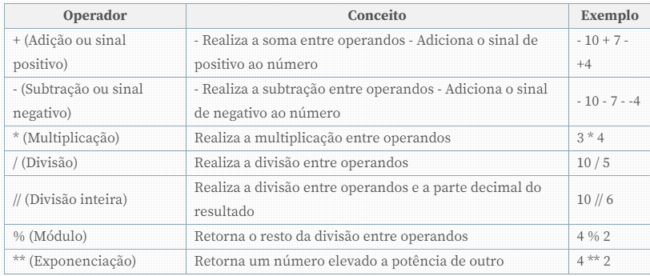
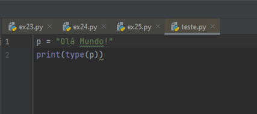
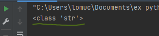
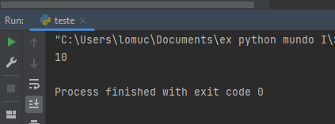
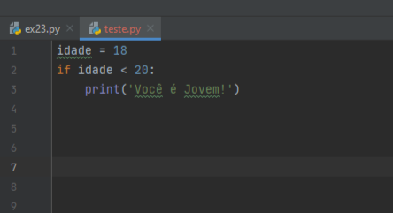
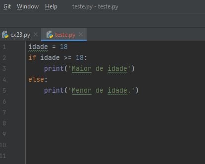
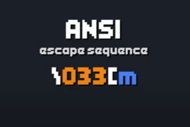
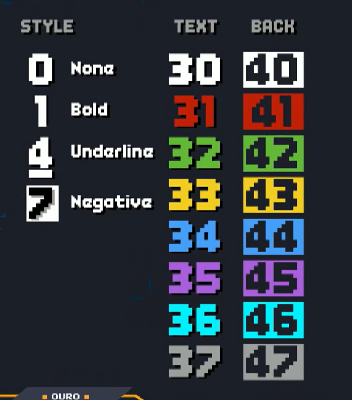
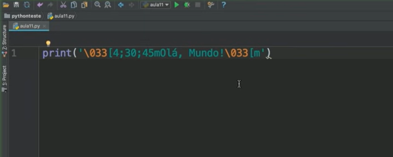

# Python---Mundo-I
Repositório criado para os exercicíos de Python do curso em vídeo com o professor Gustavo Guanabara.

[Curso em Vídeo - Python Mundo I](https://youtu.be/S9uPNppGsGo)

1. Descrição
2. Operadores Aritméticos
3. Tipos Primitivos de Dados
4. Módulos e Bibliotecas em Python
5. Manipulando strings
6. Condições If e Else
7. Adicionando cores ao Pyhton

## 1 - Descrição
Python é uma linguagem ultra moderna, utilizada por grandes empresas como Google, YouTube, Industrial Light & Magic, Globo e muitas outras. Fácil de aprender, com código limpo e organizado, Python vem ganhando cada vez mais espaço, e chegou a sua hora de aprender. Curso criado pelo Prof. Gustavo Guanabara com uma temática divertida de vídeo-game para motivar seus alunos, é dividido em mundos para facilitar o estudo.
O primeiro mundo foi pensando de forma a apresentar a linguagem ao aluno, o professor irá introduzir a linguagem, seus conceitos, montar o primeiro programa e ensinar alguns recursos básicos.

## 2 - Operadores Aritméticos
Os operadores aritméticos são utilizados na execução de operações matemáticas, tais como a soma e a subtração, por exemplo. Vejamos na tabela a lista deles.

## 3 - Tipos Primitivos de Dados

Um tipo de dado primitivo é a representação computacional de algum conceito usado no nosso cotidiano, como os números, as letras do alfabeto e os sinais de pontuação. Esses são os elementos mais básicos usados para construir um programa. O tipo de dado primitivo serve para definir a quantidade de memória alocada e a faixa de valores possíveis para uma variável. Um dado pode ser do tipo int, float, bool ou str.

## 4 - Módulos e Bibliotecas em Python
O que é um módulo e uma biblioteca?

Um módulo nada mais é do que um arquivo .py com instruções e definições em Python, para serem usados em outros programas em Python. Há diversos módulos do Python que fazem parte da biblioteca padrão. 

Uma biblioteca é um conjunto de módulos. Portanto, a biblioteca padrão Python é um conjunto de módulos disponíveis em Python para que você possa importá-los e usar as funcionalidades deles quando bem quiser.

No exemplo abaixo, criaremos um módulo que representa um círculo. Para isso, criamos um arquivo chamado circulo.py com o seguinte conteúdo:

 
 Para usar o módulo acima podemos fazer como mostrado abaixo:
 
 
 
 Note que usamos o comando **import circulo** para que pudéssemos usar as definições do módulo círculo em nosso programa. De modo geral, essa é a forma pela qual usamos módulos em Python. Caso quiséssemos utilizar apenas a função area() poderíamos importar apenas ela por meio do comando **from circulo import area**. Isso é útil em caso de módulos muito grandes e quando queremos usar apenas uma ou outra função deles.
 
 ## 5 - Manipulando strings
 
 Para manipular uma String precisamos criar uma e para isso a forma mais pratica é atribuir uma variável a qualquer palavra. O python considera tudo o que estiver entre 'aspas simples' ou "aspas duplas" como String. Utilizamos print( ) para pedir ao programa escrever na tela o que está dentro dos parênteses.

Um exemplo: P será nossa variável e Olá, mundo! nossa string então teremos...

**_Funções de Manipulação de String_**

O jeito mais básico de manipular strings é através de métodos que estão dentro delas (strings). Podemos fazer um limitado número de tarefas em strings através desses métodos. A seguir veremos alguns desses métodos.

#### > Para verificar qual é o **tipo** da variável podemos usar type() :

                

E nós teremos o retorno de que minha variável **p** é uma string:

#### > Podemos utilizar len() para vereficar quantos caracteres tem na string: 

E o resultado retornado de 10 caracteres:

 
 Essas foram só algumas das muitas formas de manipular String dentro do Python. Mais alguns sites que podem explicar e dar exemplos de manipulação de Strings:
 
 [Python Brasil](https://wiki.python.org.br/ManipulandoStringsComPython)
 
 [Data Marte](https://datamarte.com/como-manipular-strings-em-python/)
 
 [Programming Historian](https://programminghistorian.org/pt/licoes/manipular-strings-python)
 
 ## 6 - Condições If e Else
 
 O **if** e **else** são estruturas condicionais de controle que permitem avaliar uma expressão, e de acordo com o seu resultado, executar uma determinada ação.
 
 Vamos colocar em prática o uso do **if** e **else**.
 
 No código a seguir, usaremos a condição if. Verificaremos se a variável idade é menor que 20. Se caso for afirmativo, aparecerá uma mensagem na tela, se caso for negativo, o código seguirá normalmente ignorando a linha 3:
 
 
 
Como podemos notar, essa estrutura é formada pela palavra reservada if, seguida por uma condição e por dois pontos (:). As linhas abaixo dela formam o bloco de instruções que serão executadas se a condição for atendida. Para isso, elas devem ser identadas corretamente, respeitando a especificação do Python. Nesse código, apenas a instrução da linha 3 é executada, e por isso ela está tabulada. Se fosse necessária a execução de outras linhas no caso da idade ser menor que 20, elas também deveriam estar no mesmo nível de identação da linha 3.

Agora usaremos a condição if e else. Vimos anteriormente como utilizar o if para executar uma ação caso uma condição seja atendida. No entanto, nenhum comportamento específico foi definido para o caso de a condição não ser satisfeita. Quando isso é necessário, precisamos utilizar a reservada else:

Dessa vez, caso a condição avaliada na linha 3 não seja atendida, definimos o fluxo alternativo que o código deve seguir. Ou seja, se a idade não for maior ou igual a 18, o bloco abaixo da palavra reservada else deverá ser executado. Nesse caso, temos apenas uma instrução de impressão na linha 5.

## 7 - Adicionando cores ao Pyhton

Para adicionar cores no nosso terminal, usaremos o código ANSI para cores. Primeiramente, vamos entender como ele funciona.

O código ANSI começa com contra barra ( \ ) e depois vem o código. O código que funciona melhor para cores no Pyhton é o 033. Sempre que uma cor no Pyhton precisar ser representada, então começará com contra barra( \ ), seguido do código 033 e depois colchete ( [ ). Esse código precisa ser fechado, e pra isso usa-se a letra **m**.

Agora entre o **colchete** e o **m** você irá preencher com "coisas". Essas "coisas" podem ser nenhum código, um código, dois códigos ou três códigos. 

O 1º código representado será o código do estilo, ou seja, se a a fonte estrá em negrito, normal, sublinhada; em seguida será o 2º código referente a cor do texto; e por 3º e último código será informado a cor de fundo. Esses códigos de cores não precisam de uma ordem específica para funcionar, pois existe uma diferenciação numérica entre eles, como podemos ver a seguir:

Para usar essas configurações no nosso código agora, veremos no exemplo a seguir: 

Pedimos para o programa imprimir na tela a mensagem "Olá, Mundo!". Para adicionar as cores então começamos com o contra barras, o 0 e o 33, abrimos colchete e logo em seguida já colocamos a nossa 1º configuração da fonte que foi o número 4, referente ao estilo, que esse será sublinhado. Em seguida, após o ponto e vírgula, escolhemos a cor referente ao texto, que nesse caso é o número 30, que corresponde a cor branca. Por último, escolhemos a cor de fundo do nosso texto, nesse caso representado pelo número 45, que corresponde a cor lilás. Depois da última configuração que foi o número 45, precisamos adicionar o **m**. Após terminar o texto e as nossas configurações, precisamos fecha-lá, usando novamente o contra barras, o 0 e o 33, colchete e **m**. (\033[m)

